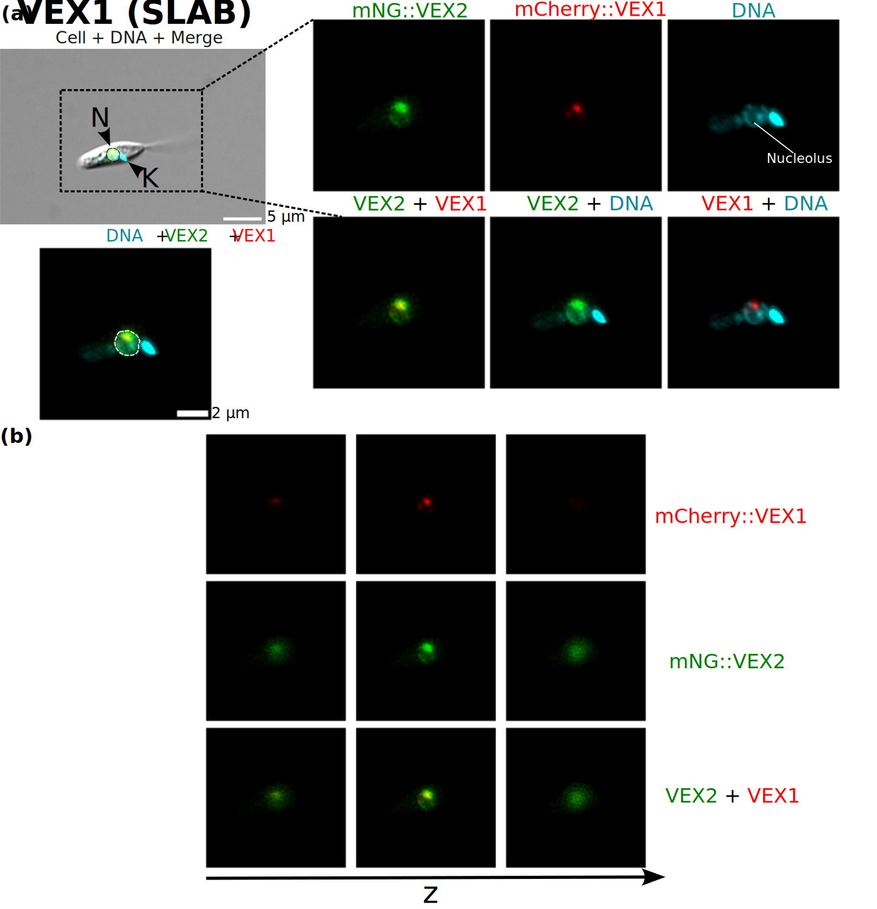
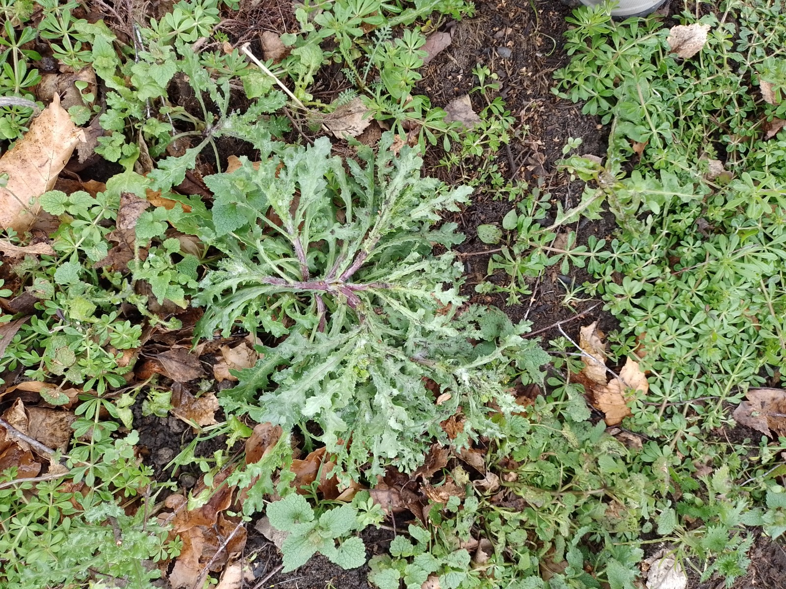
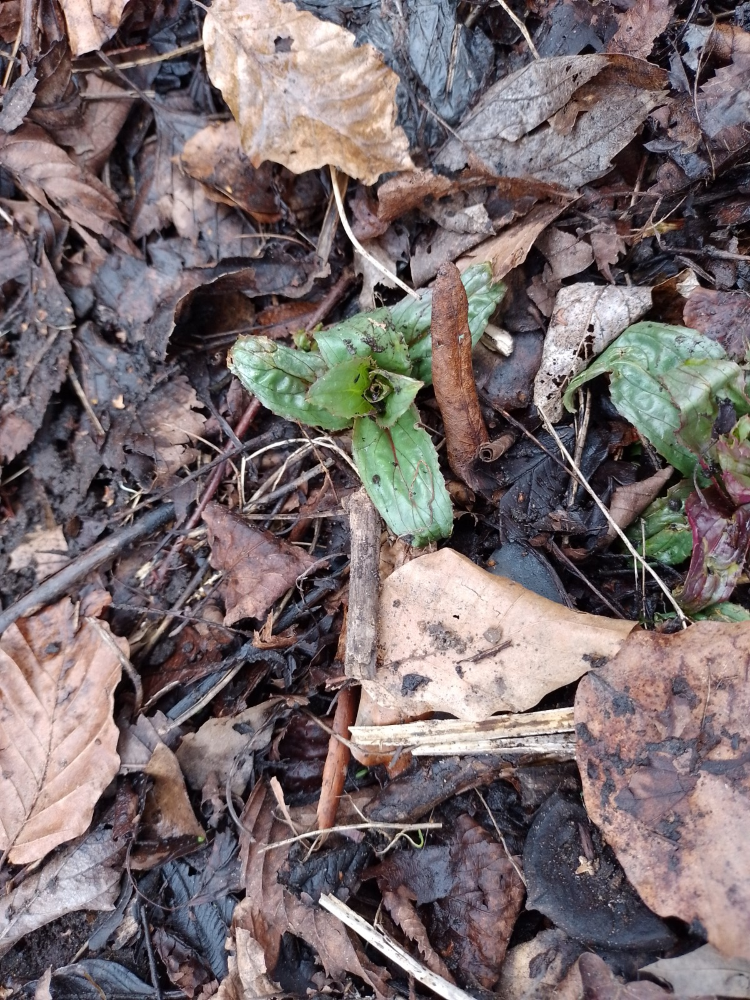

# About

Hello, my name is Piyakrit, but please call me Eng (pronounced: Ing)!  

I am an intern at the Ministry of Public Health (MOPH), Thailand, working within the Genomic Medicine division at the [Department of Medical Sciences (DMSc)](https://www.dmsc.moph.go.th/en/home). Here, I am working on various projects within [Genomics Thailand](https://genomicsthailand.com/Genomic/home) ([Facebook](https://www.facebook.com/GenomicsThailand/)) - from developing bioinformatics pipelines, performing genome-wide association studies (GWAS) to variant interpretation for genetic diseases, primarily breast cancer. All of this was new to me, but I found this endeavour satisfying!  

Prior to this, I worked on single-cell image analysis in human embryonic stem cells with Rafael Carazo-Salas at the University of Bristol. Through this project, I discovered my interests for data analysis and computational biology.

 
<em>Cell migration is a community effort. Pictured is a timelapse of differentiating human embryonic stem cells. Nuclei visualised by H2B staining.</em>

For my MSc, I took on an experimental project in parasitology with Jeremy Mottram and Joana Faria at the University of York. Here, I explored a putative RNA:DNA helicase, provisionally called VEX2, in *Leishmania mexicana*.  

  
<em>A co-transcriptional complex? Fluorescence visualisation of Leishmania "VEX2" (mCherry-tagged) and "VEX1" (mNeonGreen-tagged), a component of the splice leader array body (SLAB).</em>

Through these experiences, I realised that I appreciate research, so I am currently searching for PhD opportunities.  

## Volunteering
I enjoy volunteering, experiences include:
* **Health volunteer** - visited the elderly and chronically ill patients to check on their well-being.
* **Biodiversity Survey for [Rowntree Park](https://rowntreepark.org.uk/)** to address issues arising from flooding. I investigated plant species and soil conditions within the park's Pollinator Project.

 
<em>Two sides of the coin: weeds may be invasive but they contribute to the ecosystem. Pollinators do not discriminate!</em>  

* **Tutor** - assisted primary school students in subjects such as Mathematics, English and Norwegian.
* **Event organisation** - on various occasions, including school events and club activities. 

 

*Updated: April 2025*